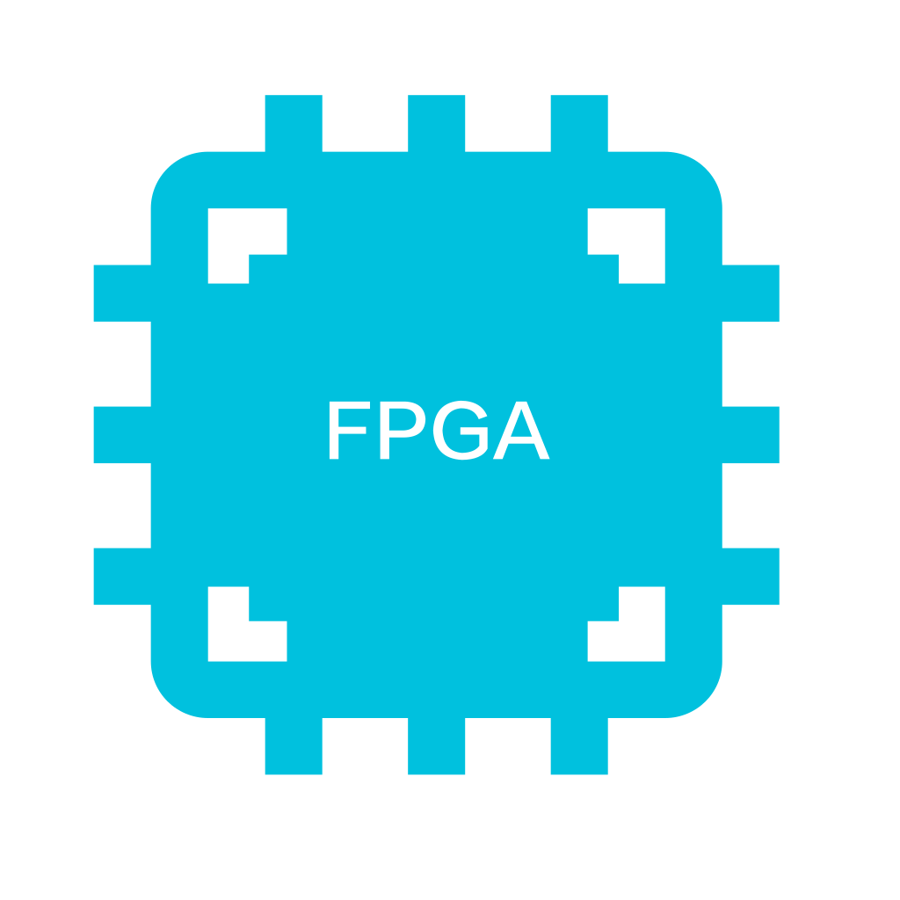
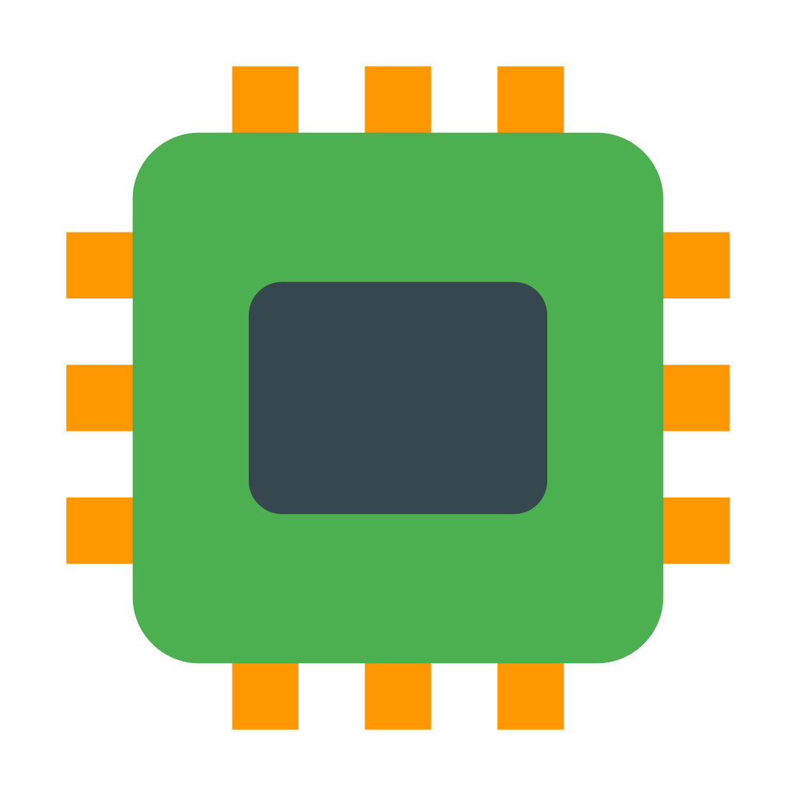
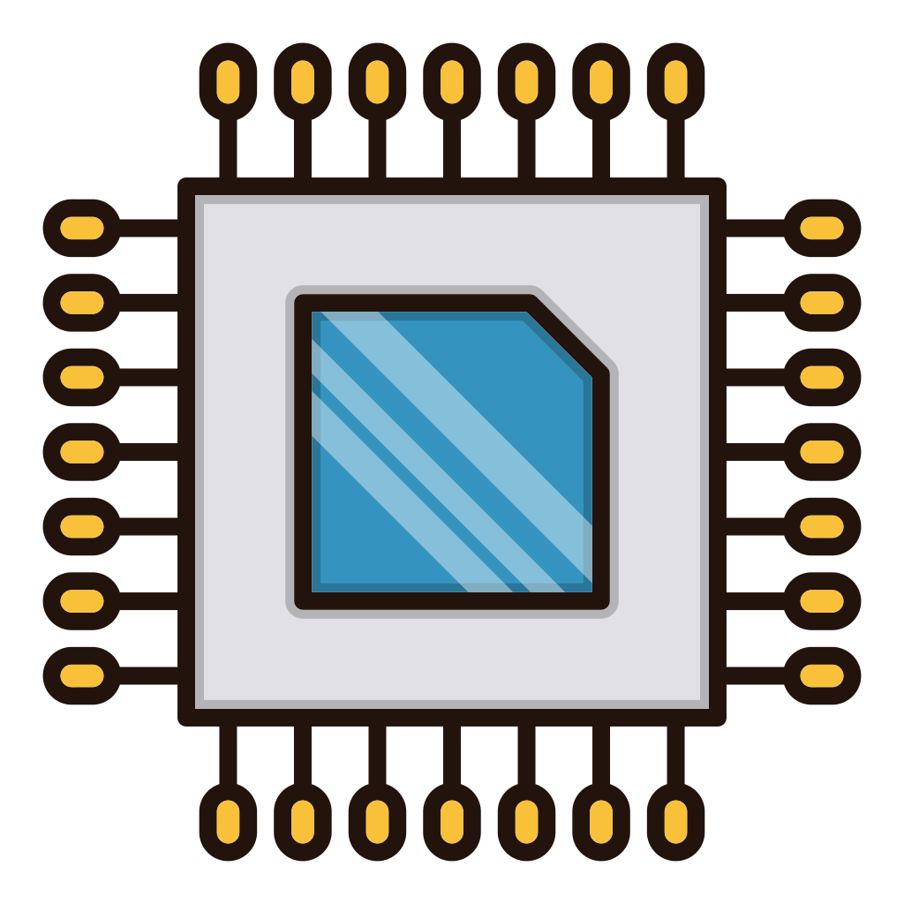
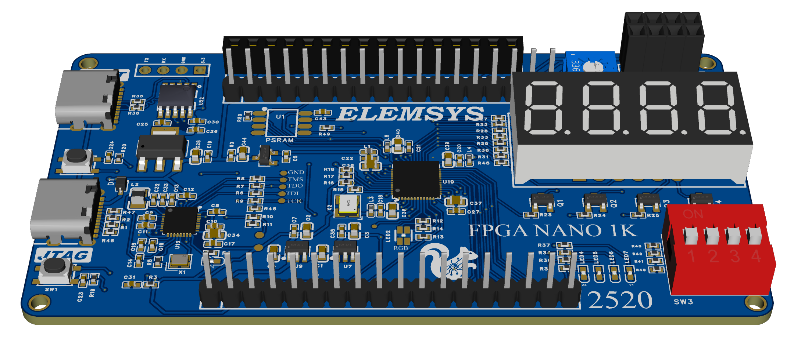

[🇬🇧 English](README.md) | [🇵🇪 Español](README.es.md)

<h1 align="center">ELEMSYS</h1>
<h3 align="center">
$$\textcolor[RGB]{9,155,218}{Advanced \;\; Embedded \;\; Systems}$$
</h3>

**_Elemsys_** is a team of professionals devoted to ✨ _electronics_ ✨, offering technological solutions to a wide range of societal challenges — from education to industrial applications.

We specialize in:

-  Design, verification, and implementation of hardware systems using FPGAs
-  Custom PCB design and assembly
-  Design and printing of 3D parts
-  Microcontroller programming: ATMEGA, ESP32, PIC, STM32
-  Consulting on artificial intelligence, machine learning, and computer vision projects
-  Consulting on electronics projects (automatic control, robotics, digital systems and electronic circuits)
---

### Projects

- **Project 1**: Serverity estimation of coffe leaf rust using FPGA.
- **Project 2**: Real-time image processing using FPGAs.
- **Project 3**: FPGA-based PID controller for speed/position control of a DC motor (⚙️ in development).
- **Project 4**: [Modeling, Simulation, Design and Comparative Analysis of the PID and LQR Controllers for an Inverted Pendulum](https://ieeexplore.ieee.org/document/10833454)

---

### Products

- [**FPGA NANO 1k**](https://github.com/elemsys/FPGA-NANO-1K/tree/main): ✅ Devlopment board based on the [*GOWIN SEMICONDUCTOR*](https://gowinsemi.com/en/) GOW1NZ-LV1 FPGA.

https://github.com/user-attachments/assets/8e457615-cc1c-4874-b13a-70dbdad3f124

- **FPGA NANO 9k**: ⚙️ Under development by [*ELEMSYS*](https://github.com/elemsys) team...
- **FPGA NANO 25k**: ⏳ Upcomming...

---

### Contact us

- **Email**: elemsys.eei@gmail.com
- **Phone**: +51 936-487-032 | +51 928-907-284
- **Facebook**: [ELEMSYS](https://www.facebook.com/elemsys.eei)
- **Youtube**: [ELEMSYS](https://www.youtube.com/@elemsys)
- **TikTok**: [ELEMSYS](https://www.tiktok.com/@elemsys.eei) | [FPGAeduDesign](https://www.tiktok.com/@fpgaedudesign)
---

### News

- Free hands-on workshop on the FPGA NANO 1k development board. August 25, 2025 — National University of San Antonio Abad in Cusco, Department of Electronic Engineering.
